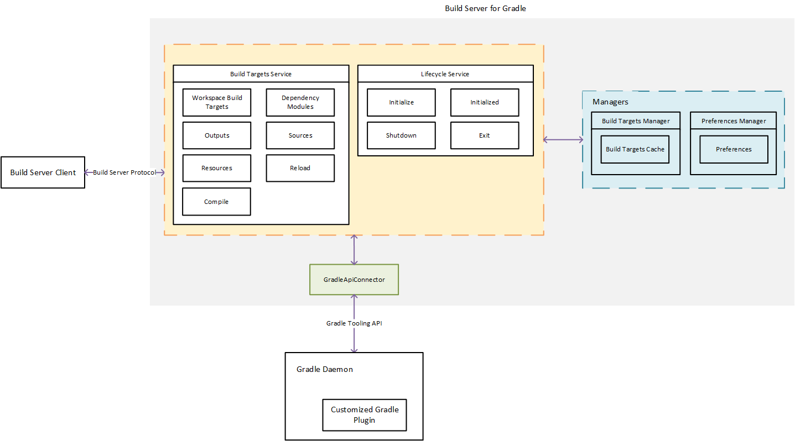

# Architecture Overview

The project has three modules:

- `model`: Shared data interfaces that shared by both `plugin` module and `server` module.
- `plugin`: A Gradle plugin that will be added to the Gradle build using the Gradle initialization script. This plugin is used to get the project structure information.
- `server`: The implementation of the Build Server for Gradle based on Build Server Protocol.

Below is a diagram of the architecture:

